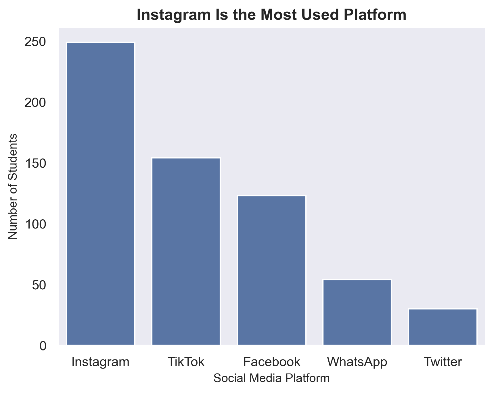
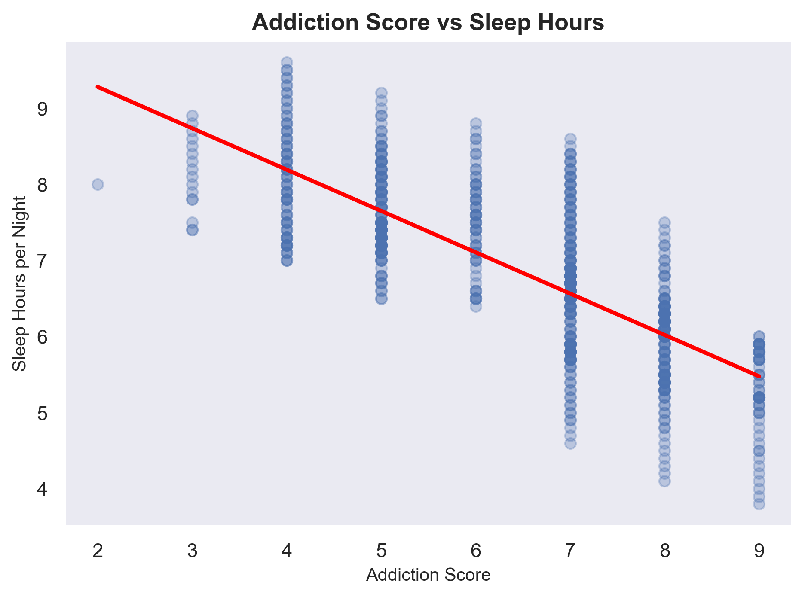
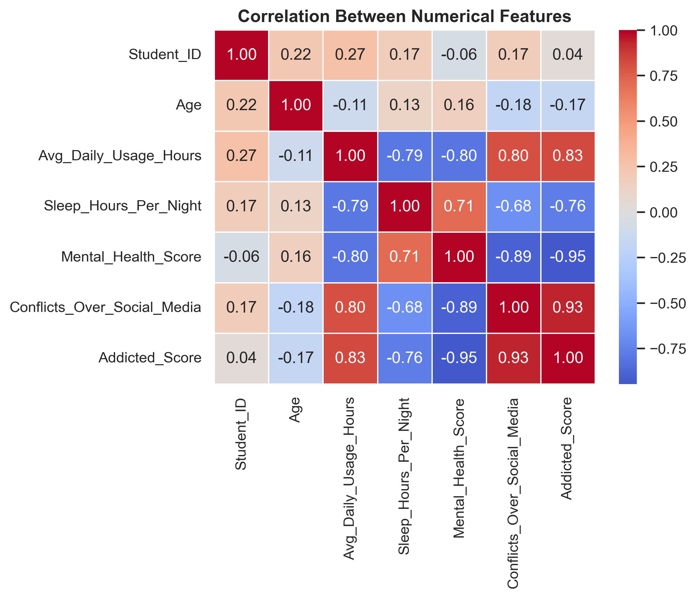

# Student Social Media Addiction – Machine Learning Project

## Project Overview

This project applies Machine Learning to analyze 705 student records and predict Social Media Addiction Scores using behavioral and lifestyle features.

The dataset contains 13 variables covering daily usage hours, sleep duration, mental health score, academic impact, platform usage, and demographics.

---

## Dataset Summary

- Total Records: 705  
- Total Features: 13  
- Target Variable: Addicted_Score (1–10 scale)  
- Average Addiction Score: 6.44  
- Average Daily Usage: 4.92 hours  
- Average Sleep Duration: 6.87 hours  
- Students Academically Affected: 64.26%  

---

## Key Visual Insights

### 1. Addiction Score Distribution

Most students fall within the 6–8 addiction score range, indicating moderate-to-high addiction levels across the dataset.

---

### 2. Addiction Score vs Sleep Hours

There is a strong negative relationship between addiction score and sleep duration. Students with addiction scores above 7 typically sleep between 4–6 hours per night.

---

### 3. Correlation Between Numerical Features

- Addiction Score vs Daily Usage: 0.83  
- Addiction Score vs Sleep Hours: -0.76  
- Addiction Score vs Mental Health: -0.95  

These strong relationships explain the high predictive power of the regression models.

---

## Data Preprocessing

- Removed 3 non-predictive columns (Student_ID, Country, Conflicts_Over_Social_Media)
- Train-Test Split: 75% Training, 25% Testing
- Label Encoding + One-Hot Encoding applied
- Min-Max Scaling applied to 4 numerical features

---

## Models Used

### Linear Regression
- R² Score: ~0.95  
- Low Mean Absolute Error  
- Strong linear relationship between features and addiction score  

### K-Nearest Neighbors (KNN) Regression
- Optimal K: 3  
- R² Score: ~0.94  
- Mean Squared Error: ~0.12  

---

## Conclusion

The models explain approximately 94–95% of the variance in addiction scores, demonstrating strong predictive relationships between daily usage, sleep duration, mental health, and social media addiction levels.
